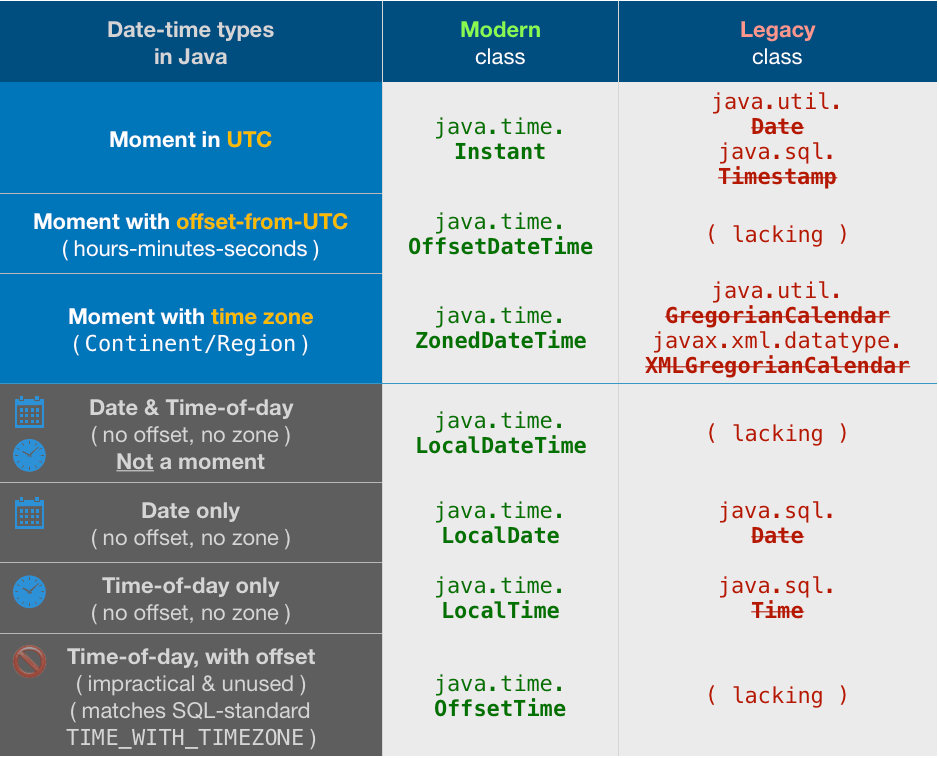

# Cvičení 14 - Java Dates

## java.util.Date
Legacy (Java 1.8.+) používá se zejména z důvodu zpětné kompatibility starších verzí. Pro nové aplikace je doporučeno použít třídy z balíčku java.time.*
  - System.currentTimeMillis();
  -  new Date();
  - Formátování datumů pomocí DateFormat + date.format() [Date formats](https://help.gooddata.com/cloudconnect/manual/date-and-time-format.html)
  - Parsování datumů ze String value pomocí DateFormat.parse()
  - operace s datumy:
      * getTime()
      * before()/after()
      * compareTo()
      * fromInstant()
  
  ## java.time.Instant
  Instant reprezentuje aktuální časovou značku na časové ose (v UTC). Nepoužívá se pro znázornění datumu a času, ale lze převádět na datum a čas například metodotu *fromInstant()*.
   - Aktuální datum a čas : *Instant.now()*
   - date.toInstant();
   - Instatnt.plus()
   - InstantIsAfter() / Instant.IsBefore();

 ## java.time.LocalDate / LocalDateTime / ZonedDateTime
 Aktuálně doporučené třídy pro uložení datumu a času. 
   - Aktuální datum a čas : *LocalDate.now()*, *LocalDateTime.now()*, *ZonedDateTime.now()*
   - LocalDate.of()
   - ChronoUnit.between();
   - .plus() /.minus()
  
  
